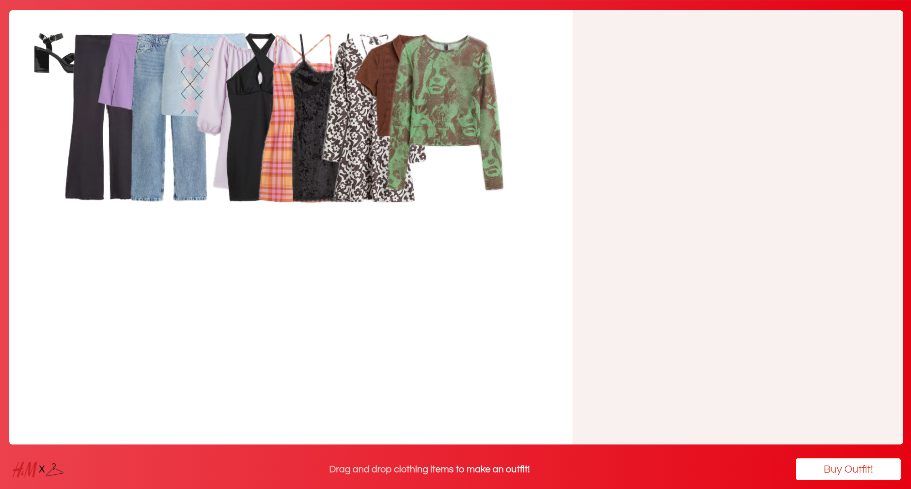
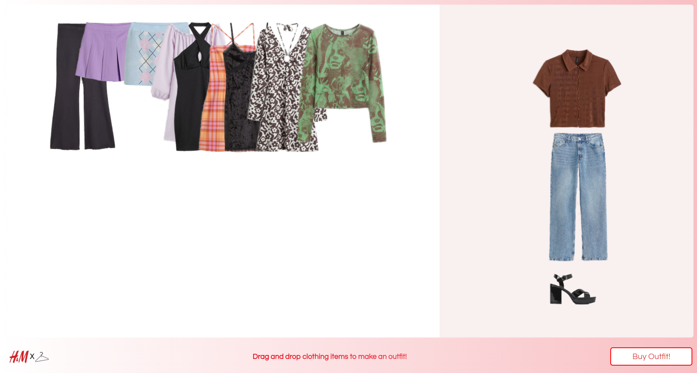

# ADA-Team3
ADA Team 3 Group Project: where we make the coolest application to impress Jam3!

## Description 

One of the biggest drawbacks to online shopping is the lack of the “fitting room experience”, an integral part of getting customers excited about clothing items. The H&M Virtual Closet (VC) is a Google chrome extension that allows customers to combine clothing items and visualize outfits in a simple but fun drag-and-drop user interface. As customers browse the H&M website, they can select items that interest them, and add them to their VC; then, they can open the VC and arrange the items into outfits. Our VC incorporates the “fitting room experience” into online shopping, which sparks customer interest with none of the hassle and stress of putting on clothes! Customers can then purchase outfit pairings they like, all with one button click!

## Team Members

* Raifah Khan

* Veronica Reingold

* Rhea Mangat

* Joy Zheng

## Student Mentors

* Joud El-Shawa

* Zayyed Mansoor

## To Run

`clone git repo

go to chrome://extensions/ and press *load unpacked* and upload the repo folder`
